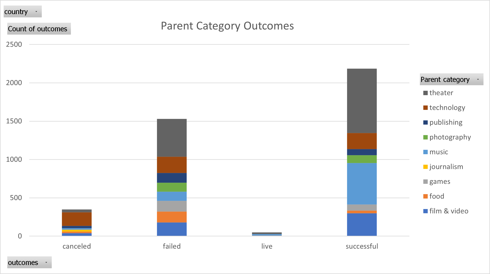
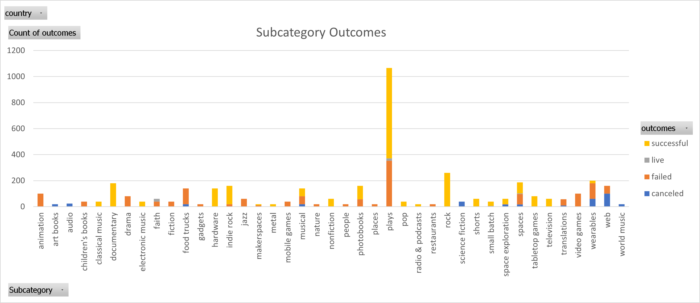
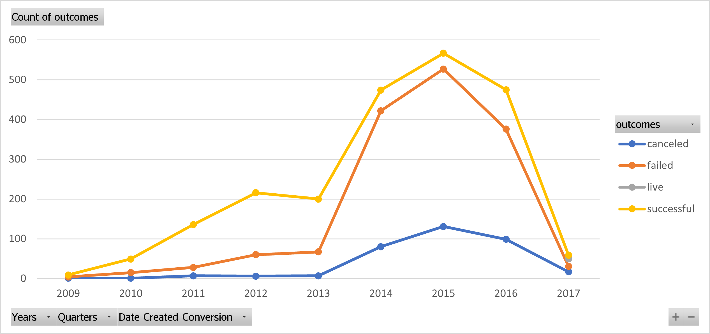
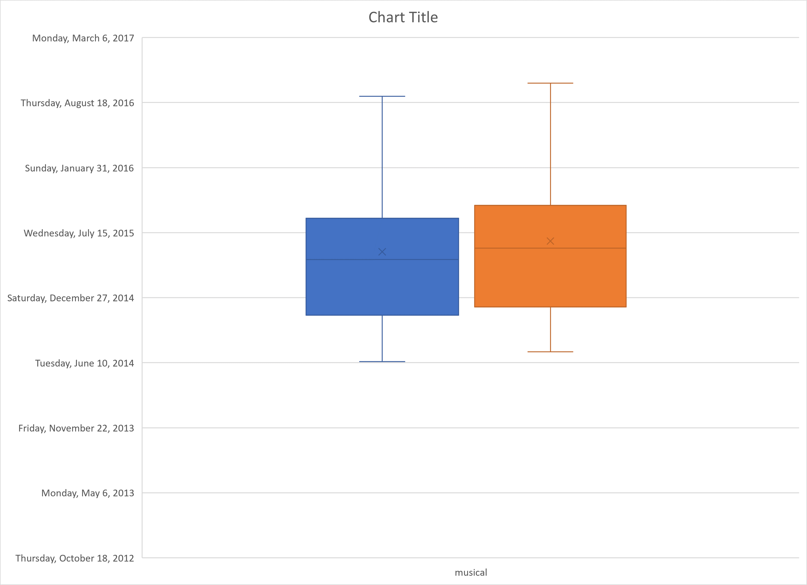

# Kickstarter_analysis
Performing analysis on Kickstarter data to uncover trends
# An Analysis of Kickstarter Campaigns ---
---
## In this project we looked through the kistarters data that was provided to find trends that can help to show how to develop a successful kickstarter campaign. ---
---
### One of the first things we did with the dataset was seperate the parent category and subcategory to further the filtering of our data. These charts show what we were able to gather by doing so. 
---

---

---
### After dividing the parent categories and subcategories, next was to convert the date launch and ended to a readable format, doing this required using a formula to convert the seconds that had passed since 1970, 1, 1 to days months and years since 1970, 1, 1. This chart below is the result of the formula.
---

---
### Next was to look at how musical kickstarters in Great Britian did and how much success, failure, cancels, and live kickstarters are in Great Britian The following graph is the following data.
---

